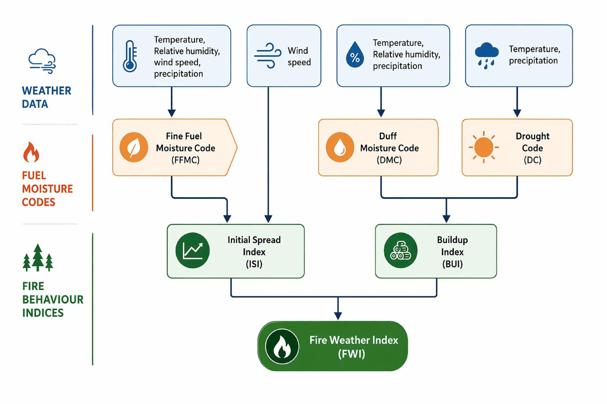

# 🔥 Robust Deep Learning Projections Reveal Intensification and Seasonal Reorganization of Fire Weather over the Iberian Peninsula

**Deep Learning Projections of Fire Weather Index over the Iberian Peninsula**

[]() 
[]()

---

## 🌍 What This Is

This repository is based on Mirones et al. (2026) - *Robust Deep Learning Projections Reveal Intensification and Seasonal Reorganization of Fire Weather over the Iberian Peninsula*, following a simple adaptation.

By combining cutting-edge deep learning with climate science, we **downscale general circulation models (GCMs) from 1.5° to 0.1° resolution**—bringing climate projections from continental scale to local detail. This enables unprecedented insights into future fire risk patterns.

---

## 🎯 The Problem We're Solving

Traditional climate models run at **coarse resolution** (~1.5°). For fire risk assessment, this is too broad:
- ❌ Cannot capture local topography and microclimates
- ❌ Misses critical fire weather "hotspots"
- ❌ Insufficient for regional adaptation planning

**Our solution:** Deep learning bridges this gap, learning patterns from high-resolution observational data and translating them to future climate scenarios.

---

## ✨ What Makes This Different

🧠 **Deep Learning**
- Captures non-linear relationships between the input variables
- Learns spatial patterns from ERA5 reanalysis (0.25° native resolution, but interpolated to 1.5º, matching with GCMs resolution)
- Generalizes to future climates

🌐 **Ultra-High Resolution**
- 0.1° = ~11 km grid spacing
- From continental (1.5°) to local (0.1º)

📊 **Multi-Model Ensemble**
- Leverages CMIP6 ensemble uncertainty. EC-EARTH3 is used in the reproducible example
- Robust projections even across climate models
- Captures both intensification and seasonal reorganization

---

## 📋 Project Workflow

### **Phase 1: Training Data Preparation** 🏗️
Extract high-resolution predictand data (ERA5-Land) and coarse climate input data (ERA5) for the historical period (1979-2014).

### **Phase 2: Deep Learning Model Development** 🧠
Train a Keras/TensorFlow neural network to learn the relationship:
```
Coarse Climate Data → Deep Neural Network [U-Net]  → High-Resolution Fire Weather Index
```
The model learns how to extract local details from regional patterns.

### **Phase 3: Climate Projections Processing** 🌍
Apply the trained model to future CMIP6 projections under the different emission scenarios. In this reproducible example, we consider the scenario SSP5-8.5 (high-emission) during the end of the century 2080-2099.

### **Phase 4: Downscaling & Results** 📈
Generate high-resolution fire weather projections. 

---

## 🔧 Technical Stack

| Component | Technology |
|-----------|------------|
| **Language** | R 4.3.3 |
| **Deep Learning** | Keras/TensorFlow |
| **Climate Tools** | climate4R, downscaleR.keras |
| **Data Format** | NetCDF|

---

## 📊 Data Sources

| Dataset | Resolution | Period | Purpose |
|---------|-----------|--------|---------|
| **ERA5-Land** | 0.1° | 1979-2014 | Instantaneous High-res reanalysis (predictand) |
| **ERA5** | 0.25° | 1979-2014 | Coarse reanalysis (predictor) |
| **CMIP6** | 1.5° | 2080-2099 | Future climate scenarios |

---

## 🌡️ What is FWI (Fire Weather Index)?



The **Canadian Fire Weather Index** combines:
- Temperature
- Humidity
- Wind speed
- Precipitation

Into a single metric: **how dangerous fire conditions are**. Higher FWI = greater fire risk.

---

## 📚 Scientific Foundation

This implementation is based on:

> **Mirones, Ó., et al. (2026).** "Robust Deep Learning Projections Reveal Intensification and Seasonal Reorganization of Fire Weather over the Iberian Peninsula." *Submitted to Earth's Future*.

The paper demonstrates that deep learning-based downscaling:
1. Reproduces fine-scale fire weather patterns better than statistical methods
2. Reveals regional hotspots of future fire intensification
3. Shows how fire seasons will shift earlier and extend later
4. Provides actionable insights for regional climate adaptation

---


## 📧 Contact & Attribution

**Author**: Óscar Mirones  
**Year**: 2026  
**Framework**: R with Keras/TensorFlow  

Questions? Check the inline notebook comments or review the published paper.

---

## ⚖️ License

MIT

---


## ⚡ Quick Start

### 1. Clone repository
```bash 
git clone https://github.com/oscarmirones/2026_Mirones_DL_FWI_Projections.git
cd 2026_Mirones_DL_FWI_Projections
```
### 2. Create your climate4R environment

  i). **Create the environment using Mamba for faster dependency resolution:**
     ```bash
     conda create -n deep-fwi -c conda-forge mamba
     ``` 
  ii). **Activate environment**
     ```bash
     conda activate deep-fwi
     ``` 
  iii). **Use Mamba to install the packages required**
     ```bash
     mamba env create -f environment.yaml
     ```
### 3. Once the environment is installed and activated, open the Jupyter notebook and enjoy
```bash
conda activate deep-fwi
jupyter-notebook
```

---
